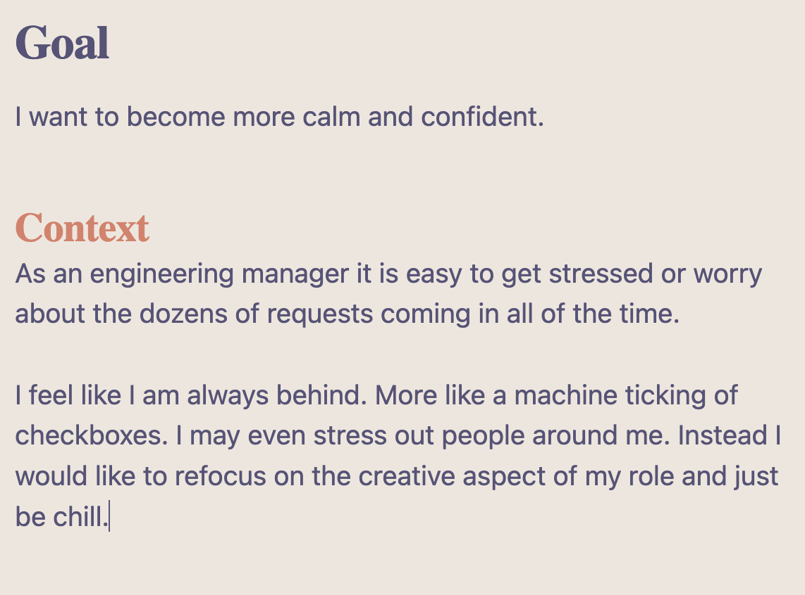
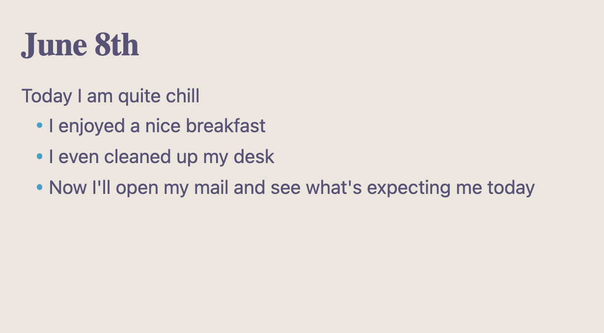
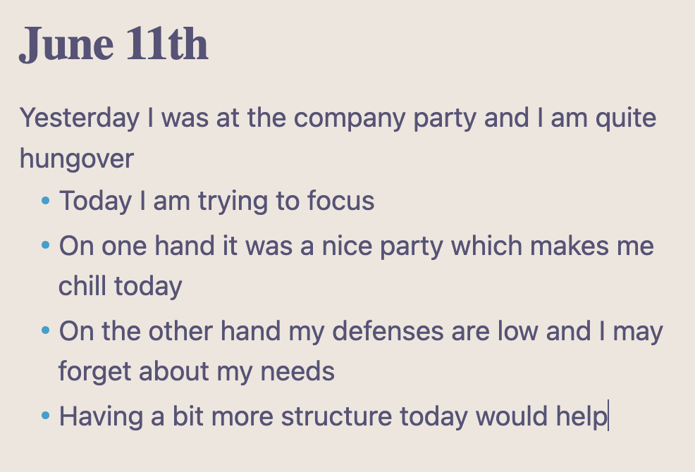
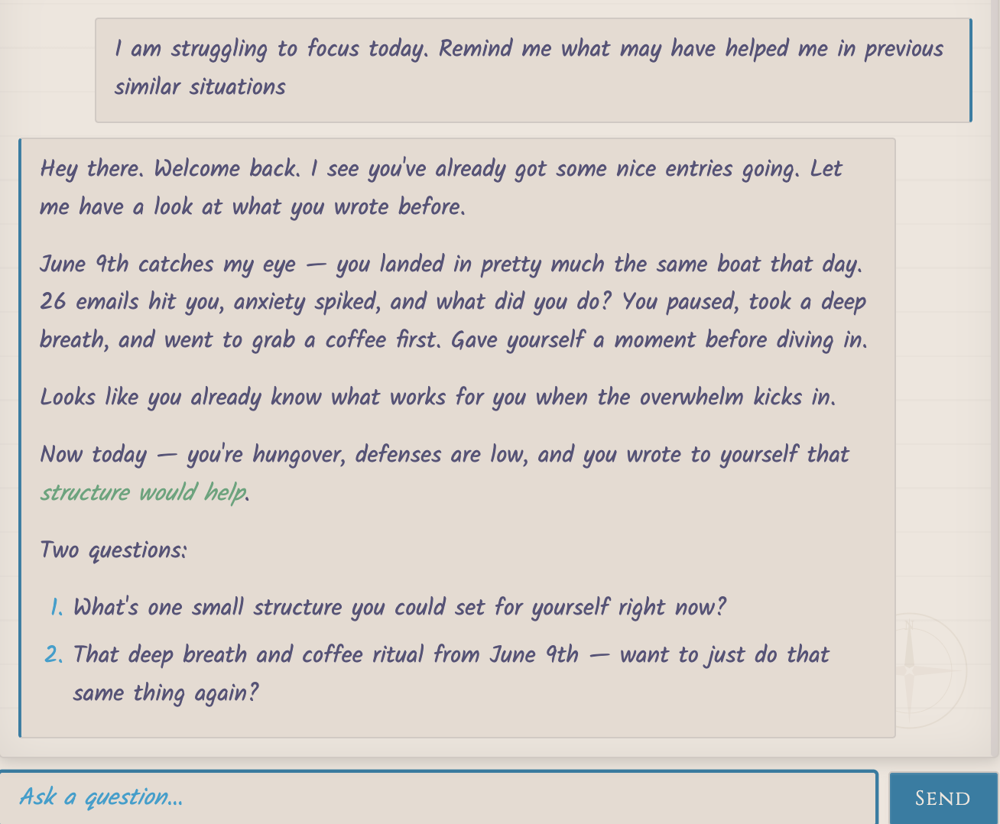
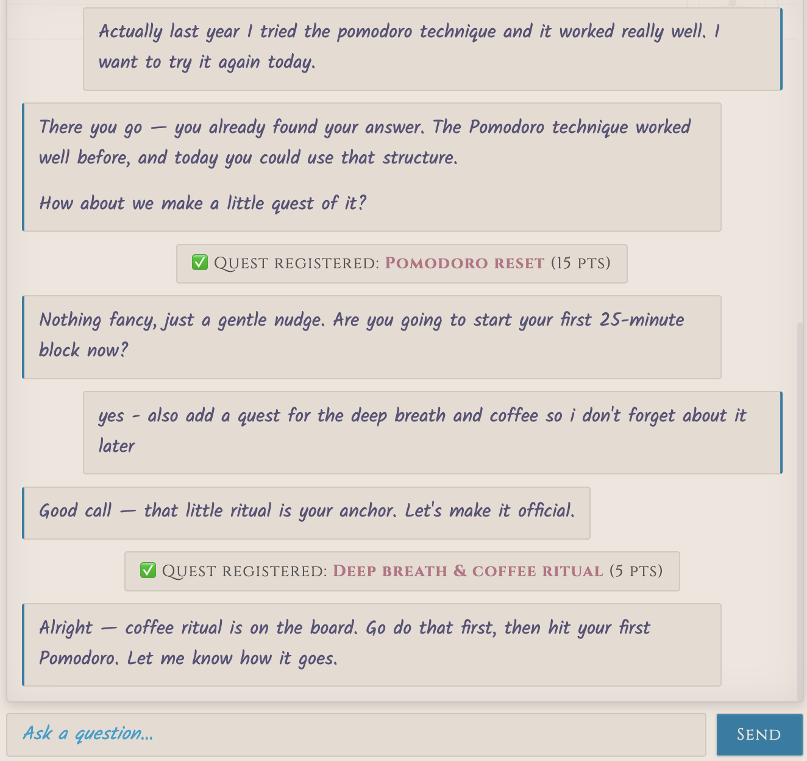
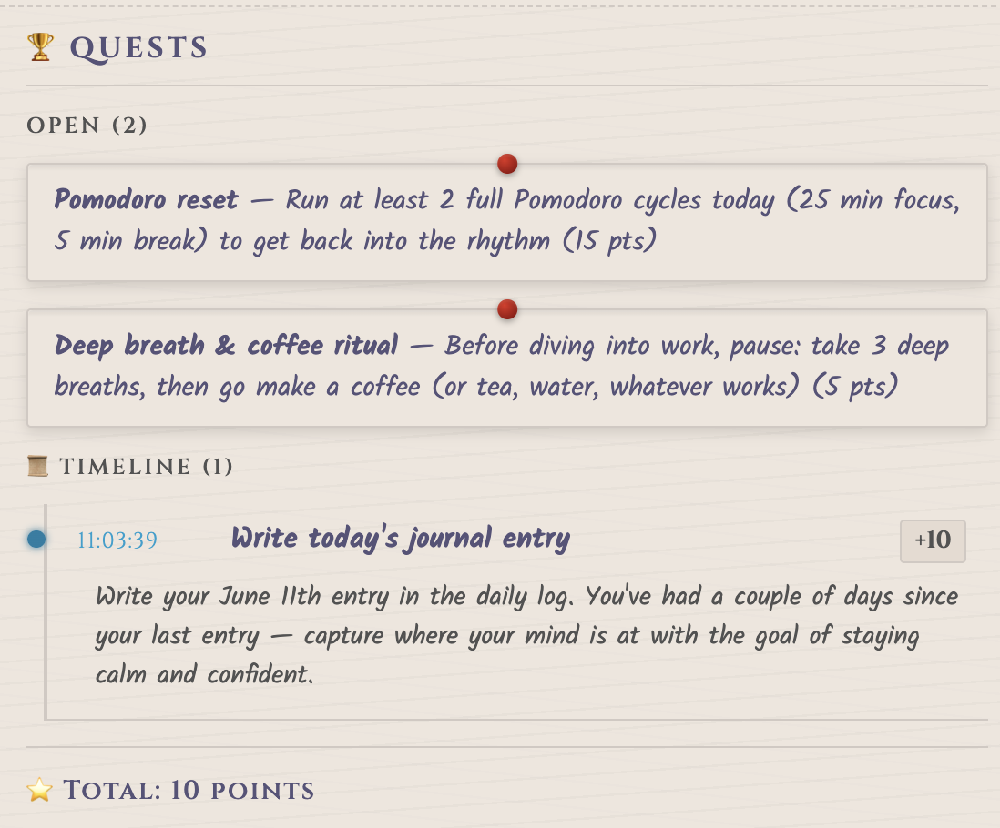

# Prompt Yourself - The Journaling Framework

> _Become your own AI agent._

**Prompt Yourself** is 
1. A simple journalling framework for _personal and professional growth_
2. An agentic _chat application_ and _game_ supporting the user to follow that framework

## The Journaling Framework

To start you just need 2 things
1. **An empty page** (physical or virtual)
2. **A goal** you really want to reach

### The Idea

Since the 1980s journalling is a well researched and established tool for
* Stress relief
* Therapy
* (Self-)Coaching
* Organising thoughts 
* ...

There are already countless frameworks like
* Freewriting or Expressive Writing
  * Goal: Unblock creativity & Mental relief
* Written Rubber-Ducking
  * Goal: Find solution for a current complex problem
* CBT Thought Model
  * Goal: Non-Judgemental processing of own thoughts
* ...

each solving their respective particular problems.

Prompt-Yourself is designed to
* Surface your thoughts and emotions (what you didn't know you knew)
* Bring order and structure into your thoughts
* Work consistently towards a solution in small steps
* While focussing on a single (often multi-facetted) goal
* Over multiple hours, weeks or even years

While it is a variation of written rubber-ducking and thus is capable of solving complex technical problems, it is even more useful for pursuing personal growth goals like 
* managing 
  * energy
  * emotions
  * carreer growth 
* or simply dealing with life. 

### The Process

Setup
1. On top of the empty page you write a paragraph detailing your goal in your words  

Every Day
1. Start a new section on the page (or new empty page) titled with the current date (e.g. "June 8th") 

2. Look at the empty page below the title, thinking about your goal

3. Write the first sentence down that comes to your mind related to the goal. Focus on what feels most immediate and relevant to you in the current moment. 

4. Stay focussed on what you just wrote and "just sit with it" and see how it feels. Then continue writing down emerging follow-up thoughts. This can be prose or a bullet point format. 

5. Repeat 4. until you are satisfied. Make sure to remind yourself on your main goal from time to time and keep your writing somehow relevant. Don't worry about spelling or it even making sense to anyone else but you. Noone else is going to read it! 

The empty page and uncompleted thought should create a certain _tension_ in you, stimulating your brain and creating the need to complete what you started. Focussing on what you already wrote should keep the thoughts from going in circles, slowly but steadily progressing to a novel perspective or idea, one step closer to a solution.

At the same time it should help you to "check in with yourself" to become aware of your mental state and how you feel in the moment, something that we often forget to prioritize and never find time to do, but is absolutely necessary for a healthy lifestyle.

Finally your journal becomes a "save state" of your thought process. Just by reading the last paragraphs you can pick up on the next day where you left off.

## The AI Application

While not needed to follow the framework and benefit from all aspects, the AI agent helps you by

* Walking you through the process
* Encouraging you to reflect deeper 
* Keeping you company & give structure, also in times where focussing may be difficult on your own
* Make the process more fun by facilitating a small game

The agent will **never**

* Give you advice
* Reference external resources outside your journal
* Drive the direction
* Do research or other work for you

But **only**

* remind you on past learnings
* support you in ways you previously identified yourself as helpful for you personally
* point out patterns you may have missed
* guide you towards identifying a concrete next step
* reward you for every step in the right direction

This ensures that you, the **user always remain in the driving seat**.

### Why not just use ChatGPT etc?

Per default most chat bots are programmed to be overly helpful. However vague of a prompt you give them they will come up with an answer, usually a rather generic one, before asking any clarifying questions. They will always aim for one-shotting a solution that sounds helpful. 

But they will also do one more thing: they will start suggesting next steps, pulling in information from anywhere they can find. They make you feel like "they got you". Your lazy brain spots the opportunity to switch off immediately and leave the heavy work to the LLM.

You may or may not figure out something relevant that way, but the less work your brain has to do, the less it will remember and if it doesn't have to it won't change. You may easily just forget what you learned within the next few days. And in any case the outcome is much more likely generic and superficial that turning into a deep self reflection with original thoughts or revelations.

At least that's my personal experience and opinion, but I'd love to know when you had a different experience.

### The Obsidian Plugin

While the application core works complete idependent from the journaling application used, right now there is only a single official plugin: for Obsidian.

Features
* Select your own LLM for the chat feature - any OpenAI compatible provider
  * Claude, Gemini, ChatGPT, ..
  * Deepseek, Kimi, Gemma, ...
  * Your **local model**
  * ...
* A chat pane in the sidebar to chat with the agent
* A little "game" / quest system

You can choose to give the LLM just access to a subdirectory of your vault, keeping the rest private. If you choose a local LLM model, the data will _not_ leave your device. Of course if you choose a hosted LLM provicer like Anthropic, your entire journal content may be processed by their servers. Their is no server backend for the plugin and it runs fully local as well so you remain entirely in control of your data.

#### Screenshots

A couple of days later a new journal entry to prime the conversation: 

<table>
  <tr>
    <td align="center"><strong>Chat Pane</strong></td>
    <td align="center"><strong>Chat Continued</strong></td>
    <td align="center"><strong>Quest Pane</strong></td>
  </tr>
  <tr>
    <td></td>
    <td></td>
    <td></td>
  </tr>
  <tr>
    <td align="center">How it might look like "prompting yourself"</td>
    <td align="center">Chat continuation in the sidebar</td>
    <td align="center">Open quests plus one completed quest on the timeline</td>
  </tr>
</table>

#### Known Issues

* At the moment the whole content of the journal is loaded into the context at the start of the conversation with the LLM, so the plugin at the moment only works for reasonably small diaries. I suggest for example <200K words for 1M token context window. A solution is under development.

* There is no guaranteed backwards compatibility between plugin versions. While your markdown journal entries of course will remain valid and untouched, plugin internal data like the timeline or quests may be corrupted or inaccessible after any update. There is a reset button in the settings that deletes all plugin data and lets you start from scratch if you run into an error after an update.

* Large parts of the codebase for this prototype are at the moment LLM generated. While I use and tested the application thoroughly myself, reviewed all of the code to some degree, kept dependencies to a minimum and made sure to keep the code complexity low and concerns well separated to be manageable for an LLM, still at the current stage this application should be treated as a POC for early adopters to receive early feedback and not as an enterprise grade product.

## ⚠️ A Warning

Self reflection may re-surface past trauma etc. or re-enforce eventual harmful thoughts. The same is true for the AI chat experience which in the end just feeds back to you what you feed it with. Trust this process and/or application at most as much as you trust yourself and obviously ask for professional help and/or feedback from friends or family if any concern arises during the process.

I, the developer of this plugin and framework, am just a random guy from the internet, not a mental health etc. professional or expert.

## Prompt Yourself

Where does the name come from?

1. **The Journaling Framework**: I found that this technique has many similarities with prompting an AI chatbot like ChatGPT & co. Instead of typing your prompt in the input field of the AI, you write it on an empty page. Then you let the words come line by line. It can feel almost automatic, but at the same time access intuition and knowledge you didn't know you possessed. As if you had ... prompted yourself.
2. **The AI Application**: When prompting tha actual LLM in the chat, the LLM doesn't use any outside ressources. It just references what you did input before. So when you prompt that agent and read its answers you may feel as if you had ... prompted yourself

So in both cases you may feel as if you had _become your own AI agent_